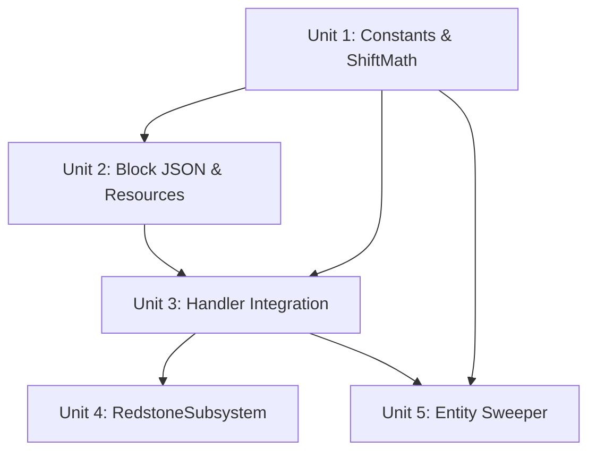

# feat: Add Winch block with linear shift movement

## Overview

Add a Winch block that moves door panels through itself via linear shift. Unlike hinges (which swing panels in a 90-degree arc), winches translate panels from one side to the other along a single axis. Panels maintain their original visual orientation — no rotation transform is applied. Obstruction checking evaluates only the destination positions.

Hidden Winch variant included, mirroring the Hidden Hinge pattern. Winch and hinge assemblies are **incompatible** — they cannot merge or pair as double-doors.

The primary use case is a portcullis: a horizontal row of winches with iron bar panels beneath, which lifts the bar plane up through the winch row on activation. A vertical column of winches can slide panels horizontally (e.g., hidden stepping stones extending out into a path).

## Problem Frame

The existing hinge system only supports 90-degree rotation with arc-based movement. Players building portcullises or drawbridge-style mechanisms need a way to move panels fully past a pivot point. The winch achieves this with a simpler movement model: mirror each panel's position through the winch column along the door-side axis, check that the destinations are clear, and teleport panels there. No arc sweep, no rotation, no direction preference.

## Requirements Trace

- R1. Winch block shifts panels linearly through itself — each panel mirrors through the winch column along the door-side axis
- R2. Obstruction check evaluates only the shift destinations — no arc, no intermediate
- R3. Winch defaults to vertical mode; mode can be switched by panel placement (same as hinges)
- R4. Hidden Winch variant follows the Hidden Hinge pattern (separate block ID, no overlay)
- R5. Winch assemblies cannot merge with hinge assemblies. Double-door pairing requires matching assembly types (both hinge-family or both winch-family)
- R6. Redstone, overlay, break/drop behavior identical to hinges
- R7. No CW/CCW direction logic for winches. The shift destination is deterministic from doorSide. Open always passes a canonical direction value since direction is meaningless
- R8. Entity sweeping for winches pushes entities at destination positions in the shift direction — no arc sampling
- R9. Creative-only for this plan. Recipes and survival acquisition are out of scope
- R10. Panels maintain their original `panel_rotation` block state — no visual rotation change during shift

## Scope Boundaries

- No new block states on door_panel — panels keep their `closedRotation()` value in both open and closed states
- No new movement animation or multi-step timing — movement is instant like hinges
- No changes to RotationMath.js — winches do not use rotation functions
- No changes to PanelRotation.openRotation() — winch panels stay at their closed rotation value
- No changes to ObstructionChecker.checkPath() — winches reuse `checkClose()` with shift destinations
- No special portcullis-linking beyond existing double-door pairing
- No Java parity in this plan (tracked separately)
- No recipes or survival acquisition — creative-only for now
- No mixed hinge/winch assemblies — incompatible by design

## Context & Research

### Relevant Code and Patterns

- **Hidden Hinge precedent**: `bigdoors:hidden_hinge` block ID, `HIDDEN_HINGE_BLOCK_ID` constant, `"hidden"` hinge type, separate block JSON with identical states, separate custom component in `main.js` — this is the exact pattern to follow for Winch/Hidden Winch
- **DoorAssembly data model**: `closedPos`/`currentPos` panel tracking, `doorSide` (direction from hinge to panels), `mode`, `facing` — all reusable as-is for winch shift logic
- **`doorSide` determines the shift axis**: "down"/"up" → Y axis, "north"/"south" → Z axis, "east"/"west" → X axis. The assembly line runs perpendicular to the shift axis (e.g., portcullis with doorSide="down" has winch row along X or Z, panels shift along Y)
- **`manager.openDoor(assemblyId, direction, newPositions)`**: Updates panel positions and persists state. Reusable as-is for winch opens
- **`manager.closeDoor(assemblyId)`**: Restores panels to `closedPos`. Reusable as-is
- **`ObstructionChecker.checkClose(closedPositions, currentPosSet, blockQueryFn)`**: Checks destination positions, excluding positions that will be vacated. Reusable for winch open checks (destinations = shift targets, exclusion = current panel positions)
- **`PanelRotation.closedRotation()`**: Returns the visual rotation for a panel's home orientation. Winch panels use this value in both open and closed states
- **Block movement is duplicated**: `InteractionHandler._attemptOpen()` and `RedstoneSubsystem._executeOpen()` both contain the three-phase move (build tuples, clear sources, place destinations). Both must gain a winch-specific branch
- **`_isHingeBlock()`**: Exists in both `HingePlacementHandler` and `PanelPlacementHandler` — must add winch block IDs
- **`_findSourceNeighbor()`**: In `RedstoneSubsystem`, skips hinge/panel blocks — must add winch block IDs
- **Hinge-type-to-block-ID mapping is scattered**: `BreakHandler.handlePanelBreak()` (line 27), `BreakHandler.handleHingeBreak()` (line 60), and `PanelPlacementHandler._updateHingeBlocks()` (line 233) all contain inline ternaries. Must be centralized into `blockIdForHingeType()` in Constants.js
- **Panel overlay gating**: `PanelPlacementHandler` sets overlay with `assembly.hingeType === "hinge" ? 1 : 0` (line 211). Must change to `isVisibleHingeType()` check that includes both `"hinge"` and `"winch"`
- **Hinge merge logic**: `HingePlacementHandler._mergeWithAdjacentHinge()` must reject merges when assembly types are incompatible
- **Double-door pairing**: `HingePlacementHandler._detectDoubleDoor()` must reject pairing when assembly types have different movement models

### Key Architectural Insight — The Shift Function

The shift mirrors each panel's position through the winch column along the door-side axis:

```
dest[axis] = minWinch[axis] + maxWinch[axis] - panel[axis]
```

This is equivalent to mirroring through the center of the winch column but avoids floating-point. Panels that are N blocks on one side of the winch column end up N blocks on the other side.

Example — portcullis (4 winches in a row, 3 rows of panels below):
```
Side view (single x-column, e.g. x=2):

         Closed             Open
         ------             ----
y=7                         P  (was y=1)
y=6                         P  (was y=2)
y=5                         P  (was y=3)
y=4      W (winch)          W
y=3      P (panel)
y=2      P (panel)
y=1      P (panel)

Top-down view at y=4 (the winch row):
  x=1  x=2  x=3  x=4
   W    W    W    W    ← single winch assembly, doorSide="down"

dest.y = min(4) + max(4) - panel.y = 8 - panel.y
  y=3 → 8-3 = 5  ✓
  y=2 → 8-2 = 6  ✓
  y=1 → 8-1 = 7  ✓
```

The winch assembly is a horizontal row (extending along X), and panels shift vertically (along Y). Winches merge along the row axis (X), NOT along the shift axis (Y). A winch placed above the row (e.g., y=5) is in the destination space and should not merge.

Example — horizontal slider (3 winches stacked vertically, 2 columns of panels):
```
Side view (single z-column):

         Closed                    Open
         ------                    ----
y=3      W  P  P          P  P    W
y=2      W  P  P          P  P    W
y=1      W  P  P          P  P    W
         x=0 x=1 x=2      x=-2 x=-1 x=0

Winches at x=0, y=1-3.  doorSide="east".  Panels at x=1,x=2.
dest.x = min(0) + max(0) - panel.x = -panel.x
  x=1 → -1  ✓
  x=2 → -2  ✓
```

The assembly does NOT need a `rotationAngle` field. The hinge type (`"winch"` / `"hidden_winch"`) stored on each hinge position entry is sufficient — a helper derives whether to use shift vs rotation at open/close time. This avoids any persistence migration.

## Key Technical Decisions

- **Linear shift, not 180-degree rotation**: Panels translate along one axis through the winch column. No rotation math is involved. This is mechanically simpler and produces the correct portcullis behavior without needing to compose rotation functions or compute open rotation values.

- **New `ShiftMath.js` domain module**: Contains `getShiftFn(hingePositions, doorSide)` which returns a `(panelPos) => destPos` function. Kept separate from `RotationMath.js` because the math is fundamentally different (translation vs rotation). Pure domain code, no `@minecraft/server` imports.

- **Reuse `checkClose()` for winch obstruction checks**: `checkClose(destinations, currentPosSet, blockQueryFn)` already does exactly what winch open needs — check a set of target positions, excluding currently-occupied positions that will be vacated. No changes to ObstructionChecker needed.

- **Panels keep their `closedRotation()` value when open**: Since panels are translated, not rotated, their visual orientation does not change. The block permutation at the destination uses the same `panel_rotation` state as the source. No call to `openRotation()` for winch assemblies.

- **Hinge type values `"winch"` and `"hidden_winch"`**: Follow the `"hinge"` / `"hidden"` pattern. The assembly's `hingeType` getter returns the primary hinge's type.

- **`isWinchType()` and `isHingeType()` helpers in Constants.js**: Determine movement model from hinge type. These gate the shift-vs-rotation branch in InteractionHandler and RedstoneSubsystem.

- **`blockIdForHingeType()` and `isVisibleHingeType()` centralized in Constants.js**: Replaces scattered inline ternaries across BreakHandler, PanelPlacementHandler, and HingePlacementHandler.

- **`areTypesCompatible(typeA, typeB)` for assembly merge/pairing**: Winch types can mix with each other (winch + hidden_winch), hinge types with each other (hinge + hidden), but not across families. Uses `isWinchType()` to compare.

- **No CW/CCW for winches**: The shift destination is fully determined by `doorSide`. Open logic always passes `"cw"` as the hardcoded canonical direction to `manager.openDoor()`, which requires a direction string. The manager stores this value in `assembly.openDirection` but it has no effect on winch movement or close behavior — `closeDoor()` restores panels to `closedPos` regardless of direction. The `"cw"` value is arbitrary; it simply satisfies the API contract.

- **Default mode `"vertical"` for winches**: The `beforeOnPlayerPlace` custom component sets initial mode to `"vertical"` instead of `"horizontal"`. Mode can still be overridden by panel placement direction, same as hinges.

- **Linear entity sweep for winches**: A new `sweepLinear(dimension, destinations, shiftAxis, shiftSign)` function pushes entities at destination positions along the shift direction, not radially from the hinge position. Simpler than arc-based sweeping.

## Open Questions

### Resolved During Planning

- **Should winch assemblies store a rotation angle or movement type?** No — `isWinchType(assembly.hingeType)` derives the movement model from the hinge type string.
- **Do we need new panel_rotation values?** No — panels keep their `closedRotation()` value in both states.
- **Should intermediate positions be checked for obstruction?** No — winches teleport through the axis. Only check destination positions.
- **Does CW vs CCW matter for winch movement?** No — the shift destination is deterministic from `doorSide`.
- **Can hinges and winches share an assembly?** No — assembly type compatibility is enforced at merge and pairing time via `areTypesCompatible()`.
- **Should winch blocks be obtainable in survival?** Not in this plan. Creative-only for now.
- **Can we reuse `checkClose()` for winch open checks?** Yes — it checks a set of destination positions excluding currently-occupied positions. This is exactly the winch open check.
- **Do we need to modify RotationMath or PanelRotation?** No — winches use translation, not rotation. Both modules are untouched.

### Deferred to Implementation

- **Exact entity push displacement magnitude for portcullis shifts**: The push vector direction is determined (shift axis × sign), but the magnitude (currently 1.5 blocks for arc sweep) may need tuning for upward vertical shifts where gravity re-drops entities into the destination. Will be verified during EntitySweeper implementation.

## High-Level Technical Design

> *This illustrates the intended approach and is directional guidance for review, not implementation specification. The implementing agent should treat it as context, not code to reproduce.*

```
Assembly type compatibility:
  isWinchType("winch")          → true
  isWinchType("hidden_winch")   → true
  isWinchType("hinge")          → false
  isWinchType("hidden")         → false

  areTypesCompatible: both winch-family OR both hinge-family
    hinge + hidden       → OK (both hinge-family)
    winch + hidden_winch → OK (both winch-family)
    hinge + winch        → REJECTED

getShiftFn(hingePositions, doorSide):
  axis = axisForDoorSide(doorSide)    // "down"/"up" → y, "north"/"south" → z, "east"/"west" → x
  minVal = min(hingePositions along axis)
  maxVal = max(hingePositions along axis)
  sum = minVal + maxVal
  return (panelPos) => { ...panelPos, [axis]: sum - panelPos[axis] }

Winch open flow (contrast with hinge):
  1. Detect winch type: isWinchType(assembly.hingeType) → true
  2. Build shiftFn via getShiftFn(assembly.hingePositions, assembly.doorSide)
  3. Compute destinations = panels.map(p => shiftFn(p.closedPos))
  4. checkClose(destinations, currentPanelPosSet, blockQueryFn) — reuse existing function
  5. If clear: destroy soft/passable blocks, sweep entities linearly, teleport panels
  6. manager.openDoor(assembly.id, "cw", destinations)

Winch close flow:
  Same as hinge close — closedPos is where panels return.
  Panel rotation value is unchanged (still closedRotation).

Hinge open flow (unchanged):
  1. isWinchType(assembly.hingeType) → false → existing hinge path
  2. Pick preferred direction via _preferredDirection()
  3. getRotateFn() → checkPath() → arc sweep → teleport
```

## Implementation Units



- [ ] **Unit 1: Constants, domain helpers, and ShiftMath**

**Goal:** Add winch block IDs, hinge type classification helpers, centralized block-ID-for-type mapping, visible-hinge-type helper, assembly compatibility helper, and the shift function. Verify `"winch"` / `"hidden_winch"` work as hinge types in DoorAssembly.

**Requirements:** R1, R4, R5, R10

**Dependencies:** None

**Files:**
- Modify: `bigdoors_bp/scripts/util/Constants.js`
- Create: `bigdoors_bp/scripts/domain/ShiftMath.js`
- Modify: `bigdoors_bp/scripts/domain/DoorAssembly.js`
- Test: `tests/DoorAssembly.test.mjs`
- Test: `tests/Constants.test.mjs`
- Test: `tests/ShiftMath.test.mjs`

**Approach:**
- Add `WINCH_BLOCK_ID = "bigdoors:winch"` and `HIDDEN_WINCH_BLOCK_ID = "bigdoors:hidden_winch"` to Constants.js
- Add `isWinchType(hingeType)` function: returns true for `"winch"` and `"hidden_winch"`
- Add `blockIdForHingeType(type)` function: maps all four types to their block IDs. Centralizes the scattered inline ternaries across BreakHandler (lines 27, 60), PanelPlacementHandler (line 233), and HingePlacementHandler
- Add `hingeTypeFromBlockId(blockId)` function: reverse mapping — `WINCH_BLOCK_ID` → `"winch"`, `HIDDEN_WINCH_BLOCK_ID` → `"hidden_winch"`, `HIDDEN_HINGE_BLOCK_ID` → `"hidden"`, `HINGE_BLOCK_ID` → `"hinge"`. Replaces private `_hingeTypeFromBlockId()` in HingePlacementHandler
- Add `isVisibleHingeType(type)` function: returns true for `"hinge"` and `"winch"` (types whose panels get the strapped overlay), false for `"hidden"` and `"hidden_winch"`
- Add `areTypesCompatible(typeA, typeB)` function: returns true when both are winch-family or both are hinge-family
- Create `ShiftMath.js` in the domain layer with `getShiftFn(hingePositions, doorSide)` that returns a `(panelPos) => destPos` function implementing the mirror formula `dest[axis] = minWinch + maxWinch - panel[axis]`
- Also export `axisForDoorSide(doorSide)` from ShiftMath for use by the entity sweeper and contiguity checks
- DoorAssembly constructor and `fromJSON` already handle arbitrary hinge type strings — verify they work with `"winch"` / `"hidden_winch"` without changes. Update constructor JSDoc `@param hingeType` from `'hinge'|'hidden'` to `'hinge'|'hidden'|'winch'|'hidden_winch'`

**Patterns to follow:**
- `HINGE_BLOCK_ID` / `HIDDEN_HINGE_BLOCK_ID` constant pattern
- Hinge type string pattern in `DoorAssembly`
- Domain module pattern — pure JS, no `@minecraft/server` imports

**Test scenarios:**
- Happy path: `isWinchType("winch")` returns true, `isWinchType("hidden_winch")` returns true
- Happy path: `isWinchType("hinge")` returns false, `isWinchType("hidden")` returns false
- Edge case: `isWinchType(undefined)` returns false
- Happy path: `blockIdForHingeType("winch")` returns `WINCH_BLOCK_ID`, same for all four types
- Edge case: `blockIdForHingeType(undefined)` returns `HINGE_BLOCK_ID` (safe default)
- Happy path: `hingeTypeFromBlockId(WINCH_BLOCK_ID)` returns `"winch"`, same for all four block IDs
- Edge case: `hingeTypeFromBlockId("unknown:block")` returns `"hinge"` (safe default)
- Happy path: `isVisibleHingeType("hinge")` returns true, `isVisibleHingeType("winch")` returns true
- Happy path: `isVisibleHingeType("hidden")` returns false, `isVisibleHingeType("hidden_winch")` returns false
- Happy path: `areTypesCompatible("hinge", "hidden")` returns true (both hinge-family)
- Happy path: `areTypesCompatible("winch", "hidden_winch")` returns true (both winch-family)
- Happy path: `areTypesCompatible("hinge", "winch")` returns false (different families)
- Happy path: `getShiftFn` with single winch at y=5, panel at y=4 → destination y=6
- Happy path: `getShiftFn` with single winch at y=5, panel at y=3 → destination y=7
- Happy path: `getShiftFn` with single winch at y=4, doorSide="down", panel at y=3 → destination y=5
- Happy path: `getShiftFn` with single winch at y=4, doorSide="down", panel at y=1 → destination y=7
- Happy path: `getShiftFn` horizontal — winch at x=0, doorSide="east", panel at x=1 → destination x=-1
- Happy path: `getShiftFn` horizontal — winch at x=0, doorSide="east", panel at x=2 → destination x=-2
- Happy path: `getShiftFn` preserves coordinates on non-shift axes (Y unchanged for horizontal shift, X/Z unchanged for vertical shift)
- Happy path: DoorAssembly with hingeType `"winch"` round-trips through `toJSON()` / `fromJSON()`

**Verification:**
- `npm test` passes with new constant, helper, and ShiftMath tests

---

- [ ] **Unit 2: Block JSON and resource pack for Winch and Hidden Winch**

**Goal:** Create the block definition files, custom components, lang strings, and textures for both Winch and Hidden Winch blocks.

**Requirements:** R3, R4, R9

**Dependencies:** Unit 1

**Files:**
- Create: `bigdoors_bp/blocks/winch.json`
- Create: `bigdoors_bp/blocks/hidden_winch.json`
- Modify: `bigdoors_bp/scripts/main.js`
- Modify: `bigdoors_rp/texts/en_US.lang`
- Modify: `tools/generate-block-json.mjs`
- Test: `tests/BlockJsonIntegrity.test.mjs`

**Approach:**
- Copy `hinge.json` → `winch.json`, change identifier to `bigdoors:winch`, change custom component to `bigdoors:winch_component`. Same states structure.
- Copy `hidden_hinge.json` → `hidden_winch.json`, change identifier to `bigdoors:hidden_winch`, change custom component to `bigdoors:hidden_winch_component`.
- Register `bigdoors:winch_component` and `bigdoors:hidden_winch_component` in `main.js` startup, following the existing hinge/hidden_hinge pattern. Key difference: `beforeOnPlayerPlace` sets initial mode to `"vertical"` instead of `"horizontal"`.
- Add lang strings: `tile.bigdoors:winch.name=Winch` and `tile.bigdoors:hidden_winch.name=Hidden Winch`.
- Winch blocks reuse existing hinge textures/geometry (strapped_sides for winch, hidden appearance for hidden_winch).
- **Update `tools/generate-block-json.mjs`**: Add a `generateWinch(panelTexMap)` function that regenerates `winch.json` permutations the same way `generateHinge()` regenerates `hinge.json`. The winch uses the same geometry and overlay textures as the hinge — the only difference is the source/target file. Call `generateWinch(panelTexMap)` from the main block after `generateHinge()`. This ensures winch.json stays in sync if the generator is rerun after materials change. Hidden variants (`hidden_hinge.json`, `hidden_winch.json`) have no permutations to generate — they use fixed geometry — so no generator step is needed for them.
- Add a test in `BlockJsonIntegrity.test.mjs` that verifies winch/hidden_winch JSON files have structurally identical states to their hinge counterparts.

**Patterns to follow:**
- `hinge.json` / `hidden_hinge.json` block definitions
- `bigdoors:hinge_component` / `bigdoors:hidden_hinge_component` registration in `main.js`

**Test scenarios:**
- Happy path: Parse `winch.json` — identifier is `bigdoors:winch`, contains expected custom component name, has all required states matching `hinge.json`
- Happy path: Parse `hidden_winch.json` — identifier is `bigdoors:hidden_winch`, states match `hidden_hinge.json`
- Happy path: Both JSON files have valid `minecraft:custom_components` entries
- Happy path: Lang file contains `tile.bigdoors:winch.name` and `tile.bigdoors:hidden_winch.name` entries
- Integration: Structural parity test — winch.json states identical to hinge.json states, hidden_winch.json states identical to hidden_hinge.json states
- Integration: Running `generate-block-json.mjs` produces `winch.json` with the same permutation count as `hinge.json`
- Edge case: Permutation count for each block does not exceed 65,536

**Verification:**
- Block JSON integrity tests pass
- Winch and Hidden Winch blocks appear in creative inventory
- Placing a winch sets facing from player view direction and initial mode to `"vertical"`

---

- [ ] **Unit 3: Handler integration — placement, break, interaction, and assembly compatibility**

**Goal:** Wire winch block IDs into all handlers so placement creates assemblies with type compatibility enforcement, break dissolves them with correct drops, interaction triggers linear-shift open/close, and panel overlay is correctly applied for winch assemblies.

**Requirements:** R1, R2, R4, R5, R6, R7, R10

**Dependencies:** Units 1, 2

**Files:**
- Modify: `bigdoors_bp/scripts/handler/HingePlacementHandler.js`
- Modify: `bigdoors_bp/scripts/handler/PanelPlacementHandler.js`
- Modify: `bigdoors_bp/scripts/handler/InteractionHandler.js`
- Modify: `bigdoors_bp/scripts/handler/BreakHandler.js`
- Test: `tests/HingePlacementHandler.test.mjs`
- Test: `tests/InteractionHandler.test.mjs`
- Test: `tests/BreakHandler.test.mjs`
- Test: `tests/PanelPlacementHandler.test.mjs`

**Approach:**
- **HingePlacementHandler**:
  - Add `WINCH_BLOCK_ID` and `HIDDEN_WINCH_BLOCK_ID` to imports and `register()` subscription filter.
  - Replace private `_hingeTypeFromBlockId()` / `_blockIdForHingeType()` with imports of centralized helpers from Constants.js.
  - Add winch IDs to `_isHingeBlock()`.
  - **Assembly compatibility in `_mergeWithAdjacentHinge()`**: Filter incompatible neighbors out of the `adjacent` map before choosing the canonical assembly. For each neighbor, check `areTypesCompatible(hingeType, existing.hingeType)` — if incompatible, exclude it from `adjacent`. This ensures the canonical selection only considers compatible assemblies. If no compatible neighbor exists, create a new assembly.
  - **Double-door compatibility in `_detectDoubleDoor()`**: Before pairing, check `areTypesCompatible()`. Reject pairing when types are incompatible.
- **PanelPlacementHandler**: Add winch block IDs to `_isHingeBlock()`. Update `register()` subscription filter to also exclude `WINCH_BLOCK_ID` and `HIDDEN_WINCH_BLOCK_ID`. Replace inline overlay check (line 211) with `isVisibleHingeType()`. Replace inline ternary in `_updateHingeBlocks()` (line 233) with `blockIdForHingeType()`.
  - **Double-door compatibility in `_checkDoubleDoor()`**: After finding a candidate partner assembly, check `areTypesCompatible(assembly.hingeType, other.hingeType)` before calling `pairAndSplitAssemblies()`. Reject pairing when types are incompatible. This closes the second pairing path — `HingePlacementHandler._detectDoubleDoor()` handles hinge-triggered pairing, but `PanelPlacementHandler._checkDoubleDoor()` can also trigger pairing when panels bridge two assemblies.
- **InteractionHandler**:
  - In `_tryOpen()`: if `isWinchType(assembly.hingeType)`, short-circuit to winch open path (bypass `_preferredDirection()` and fallback direction entirely):
    - Build `shiftFn` via `getShiftFn(assembly.hingePositions, assembly.doorSide)`
    - Compute destinations from `shiftFn`
    - Validate all destinations are in loaded chunks (`dimension.getBlock(dest) !== null`), matching the existing hinge pattern
    - Call `checkClose(destinations, currentPanelPosSet, blockQueryFn)` for obstruction — note: check `result.canClose` (not `result.canOpen`)
    - If clear: destroy soft/passable blocks, call `sweepLinear()` (not `sweep()`), teleport panels (three-phase move), call `manager.openDoor(assembly.id, "cw", destinations)` — the `"cw"` value is a required but meaningless parameter for winches
    - No direction preference, no fallback attempt
  - **`_tryOpenPartner()`**: must also branch on `isWinchType()`. For winch partner assemblies, skip the `mirrorDir` computation (direction is meaningless) and call the winch open path with the partner's own `shiftFn` computed from the partner assembly's `hingePositions` and `doorSide`. Each partner computes its own independent shift.
  - For hinge-type assemblies: existing logic unchanged
  - Panel block permutation at destination uses `closedRotation()` value (no `openRotation()` call for winches)
  - `_close()` unchanged — it already restores `closedPos` and uses `closedRotation()`
- **BreakHandler**: Replace inline ternaries in `handlePanelBreak()` (line 27) and `handleHingeBreak()` (line 60) with `blockIdForHingeType()`.
- **DoorManager**: No changes needed. The existing contiguity axis logic (`mode === "horizontal" ? "y" : facing-based`) already computes the correct axis for winch assemblies — the assembly line runs perpendicular to the shift direction, same as hinges. For a portcullis (vertical shift, winch row along X), the axis is X. For a horizontal slider (horizontal shift, winch column along Y), the axis is Y in horizontal mode.

**Patterns to follow:**
- Existing `HIDDEN_HINGE_BLOCK_ID` handling in each handler
- Centralized helper pattern from Unit 1
- Three-phase block movement pattern in existing `_attemptOpen()`

**Test scenarios:**
- Happy path: HingePlacementHandler creates assembly with hingeType `"winch"` when a winch block is placed
- Happy path: InteractionHandler opens a winch assembly — panels shift to mirrored positions through winch column
- Happy path: InteractionHandler closes a winch assembly — panels return to closedPos
- Happy path: Winch open preserves panel_rotation block state (closedRotation value unchanged)
- Happy path: Breaking a winch hinge drops `bigdoors:winch` item; breaking hidden_winch drops `bigdoors:hidden_winch`
- Happy path: Breaking last panel from a winch assembly resets hinge blocks to `bigdoors:winch` (not `bigdoors:hinge`)
- Happy path: PanelPlacementHandler recognizes winch blocks as hinge blocks for panel attachment
- Happy path: PanelPlacementHandler sets overlay=1 for winch assemblies (visible hinge type)
- Happy path: PanelPlacementHandler sets overlay=0 for hidden_winch assemblies
- Happy path: Winch open skips `_preferredDirection()` — direction is irrelevant
- Happy path: Winch open does not attempt fallback direction (no second attempt)
- Edge case: Winch open with multi-winch row — 4 winches at y=4 x=1-4, panels at y=1-3 x=1-4, each column shifts up through its winch
- Edge case: Winch open obstruction — solid block at a destination position blocks the open
- Edge case: Winch open obstruction — a destination that overlaps a vacated panel position is NOT flagged
- Edge case: Placing a winch adjacent to a hinge assembly does NOT merge — creates a new assembly
- Edge case: Placing a winch adjacent to another winch assembly DOES merge
- Edge case: Placing a hidden_winch adjacent to a winch assembly DOES merge (same family)
- Edge case: Double-door pairing rejected when one assembly is hinge-family and the other is winch-family (via HingePlacementHandler._detectDoubleDoor)
- Edge case: Double-door pairing rejected via PanelPlacementHandler._checkDoubleDoor() when panel bridges a hinge assembly and a winch assembly
- Edge case: PanelPlacementHandler._checkDoubleDoor() succeeds when both assemblies are winch-family
- Integration: Winch with double-door pairing — both assemblies are winch-family, partner opens with shift
- Integration: `_tryOpenPartner()` for winch double-door — partner builds its own `shiftFn` from its own `hingePositions`/`doorSide`, does not use `mirrorDir`
- Edge case: Placing a winch between a hinge assembly and a winch assembly — only merges with the compatible winch assembly, not the hinge
- Edge case: Placing a winch above an existing winch (along the shift axis) does NOT merge — it's in the destination space, not adjacent along the assembly row
- Integration: Portcullis row of 4 winches at y=4 x=1-4 with panels below — removing middle winch (x=2) breaks contiguity along X, assembly dissolves

**Verification:**
- All existing tests pass (no regression from hinge behavior)
- New winch-specific tests pass
- Assembly compatibility enforcement tested

---

- [ ] **Unit 4: RedstoneSubsystem winch support**

**Goal:** Wire winch block IDs and linear shift into the redstone open/close path.

**Requirements:** R1, R2, R6, R7

**Dependencies:** Units 1, 3

**Files:**
- Modify: `bigdoors_bp/scripts/subsystem/RedstoneSubsystem.js`
- Test: `tests/RedstoneSubsystem.test.mjs`

**Approach:**
- Add winch block IDs to `_findSourceNeighbor()` skip list.
- In `_openWithRedstone()`: if `isWinchType(assembly.hingeType)`, short-circuit to winch path (bypass `_preferredDirectionFromSignal()` and fallback entirely):
  - Build `shiftFn` via `getShiftFn(assembly.hingePositions, assembly.doorSide)`
  - Compute destinations
  - Validate all destinations are in loaded chunks
  - Call `checkClose()` for obstruction — note: check `result.canClose` (not `result.canOpen`)
  - No fallback direction attempt
- In `_executeOpen()`: for winch assemblies, use `closedRotation()` value for block permutations (no `openRotation()` call). Three-phase move with shift destinations.
- In `_panelStates()`: when the assembly is a winch type, return `closedRotation()` for the rotation state (panels don't change visual orientation).
- **Partner opens**: In `_openWithRedstone()` partner path, must also branch on `isWinchType()`. For winch partners, skip `mirrorDir` computation and build an independent `shiftFn` from the partner assembly's own `hingePositions` and `doorSide`. Each partner computes its own shift. Pass `"cw"` as the canonical direction.
- `_closeSingleAssembly()` uses `closedRotation()` which is type-independent — no change needed.

**Patterns to follow:**
- Mirror the approach from InteractionHandler in Unit 3 (winch = shift, no direction preference)

**Test scenarios:**
- Happy path: Redstone signal opens winch assembly with linear shift
- Happy path: Redstone power-off closes winch assembly back to closedPos
- Happy path: Redstone open for winch skips `_preferredDirectionFromSignal()`
- Happy path: Redstone open for winch does not attempt fallback direction
- Happy path: `_findSourceNeighbor()` skips winch blocks (not treated as redstone sources)
- Happy path: Redstone-opened winch panels have unchanged panel_rotation values
- Integration: Redstone-triggered double-door with winch assemblies — both open with shift, each partner computes its own shift independently

**Verification:**
- All existing RedstoneSubsystem tests pass
- New winch-specific redstone tests pass

---

- [ ] **Unit 5: Entity sweeper winch support**

**Goal:** Add a linear sweep function for winch opens where there is no arc — push entities at destination positions in the shift direction.

**Requirements:** R8

**Dependencies:** Units 1, 3

**Files:**
- Modify: `bigdoors_bp/scripts/subsystem/EntitySweeper.js`
- Test: `tests/EntitySweeper.test.mjs`

**Approach:**
- Add a new `sweepLinear(dimension, destinations, shiftAxis, shiftSign)` function. Unlike the arc-based `sweep()`, this:
  - Takes only destination positions (no arc midpoints)
  - Pushes entities in the shift direction (along axis, in the sign direction) instead of radially from hinge
  - Computes a **3D bounding box** around all destination positions — unlike `sweep()` which uses a single Y level and 2D X/Z radius, `sweepLinear` must compute center and maxDistance from the full 3D bounds (min/max of X, Y, and Z). This is critical for vertical winch shifts spanning multiple Y levels (e.g., portcullis moving from y=1..3 to y=6..8 — a single-Y-level query would miss entities at the destination height)
- `shiftAxis` is "x", "y", or "z" (from `axisForDoorSide(doorSide)`). `shiftSign` is +1 or -1 — derived by comparing the first panel's destination to its source along the shift axis: `sign = Math.sign(destinations[0][axis] - sources[0][axis])`. This is the direction panels are moving, which is the direction to push entities clear.
- Callers (InteractionHandler and RedstoneSubsystem) derive `shiftAxis` and `shiftSign` from the assembly's `doorSide` and the computed destinations, then call `sweepLinear()` for winch assemblies instead of `sweep()`.
- Existing `sweep()` is unchanged — hinges continue to use arc-based sweeping.

**Patterns to follow:**
- Existing `sweep()` entity query and teleport pattern
- `axisForDoorSide()` from ShiftMath.js

**Test scenarios:**
- Happy path: `sweepLinear()` pushes entities at destination positions in the shift direction
- Happy path: `sweepLinear()` does not query or push entities at arc positions (no arc computation)
- Happy path: Existing `sweep()` still uses arc-based positions (backward compatible)
- Edge case: Portcullis sweep with destinations spanning y=5..7 — 3D bounding box center and maxDistance cover all destination Y levels, not just the winch row Y
- Edge case: Entity standing at y=7 (top of destination range) is detected and pushed — would be missed by a single-Y-level query
- Edge case: Entity at a destination position is pushed in the correct axis direction
- Edge case: Horizontal winch sweep — 3D bounding box degenerates to single-Y-level correctly (all destinations share Y)

**Verification:**
- All existing EntitySweeper tests pass
- New linear sweep tests pass

## System-Wide Impact

- **Interaction graph:** InteractionHandler and RedstoneSubsystem both contain open/close logic that must gain a winch branch — including the partner open paths (`_tryOpenPartner` and the partner block in `_openWithRedstone`). The `_isHingeBlock()` check in PanelPlacementHandler and HingePlacementHandler gates panel attachment and hinge merging — winch blocks must be included. The hinge-type-to-block-ID mapping in BreakHandler (lines 27, 60) and PanelPlacementHandler (line 233) must all use the centralized `blockIdForHingeType()` helper.
- **Assembly compatibility:** `_mergeWithAdjacentHinge()` and `_detectDoubleDoor()` in HingePlacementHandler, plus `_checkDoubleDoor()` in PanelPlacementHandler, must enforce type compatibility. Both pairing paths are guarded.
- **Contiguity axis:** DoorManager's existing axis computation (mode+facing) already gives the correct perpendicular axis for winch assemblies — no changes needed. Winches form a line perpendicular to the shift direction, same as hinges.
- **Error propagation:** No new failure modes — winches follow identical error paths as hinges. The "no fallback direction" for winches is not a failure — it's a simplification (only one attempt needed).
- **State lifecycle risks:** No new state fields on DoorAssembly — the hinge type string (`"winch"`) is already supported by the existing `type` field on hinge position entries. Persistence is backward-compatible (old worlds simply won't have winch assemblies).
- **API surface parity:** The duplicate open/close logic in InteractionHandler and RedstoneSubsystem must receive matching winch branches. Both must detect winch type, build shift function, use `checkClose()` for obstruction, and use `closedRotation()` for panel states.
- **Panel overlay parity:** PanelPlacementHandler overlay logic must use `isVisibleHingeType()` instead of `=== "hinge"` so winch assemblies get the strapped overlay and hidden_winch assemblies do not.
- **Entity sweep divergence:** `sweep()` (arc-based) remains for hinges. `sweepLinear()` (axis-based) is used for winches. Both callers (InteractionHandler, RedstoneSubsystem) must select the correct sweep function based on assembly type.
- **Unchanged invariants:** `DoorAssembly.toJSON()` / `fromJSON()` serialization format does not change. `closedRotation()` is used for both hinge and winch panels. `RotationMath.js` and `PanelRotation.js` are untouched. `ObstructionChecker.checkPath()` and `checkClose()` are unchanged — winches reuse `checkClose()` as-is. `computeArcPositions()` is unchanged — winches simply don't call it.

## Risks & Dependencies

| Risk | Mitigation |
|------|------------|
| Duplicate open/close logic in InteractionHandler and RedstoneSubsystem grows from 2 to 4 code paths (hinge+winch × 2 handlers) | Unit 4 explicitly mirrors Unit 3 changes; test both paths. Extracting a shared movement executor is desirable but out of scope — tracked as follow-up tech debt |
| Permutation count growth from new block JSONs | Winch blocks have same states as hinge blocks (well within 65,536 limit per block) |
| Scattered hinge-type-to-block-ID ternaries missed during update | Centralized `blockIdForHingeType()` helper in Unit 1; all inline mappings replaced in Unit 3 |
| Panel overlay missing on winch assemblies | `isVisibleHingeType()` helper covers winch; tested explicitly in Unit 3 |
| Winch.json / hidden_winch.json drift from hinge source files | Structural parity test in Unit 2 guards against state divergence |
| Player accidentally merges hinge + winch by placing adjacent | `areTypesCompatible()` check in merge logic rejects incompatible types |
| Player accidentally pairs hinge + winch via panel bridging | `areTypesCompatible()` check in both `HingePlacementHandler._detectDoubleDoor()` and `PanelPlacementHandler._checkDoubleDoor()` |
| Winch placed along shift axis accidentally merges with assembly | Merge logic only considers blocks adjacent along the contiguity axis (perpendicular to shift); verified by test scenario |
| Winch.json permutations drift from hinge.json after generator rerun | `generateWinch()` added to `generate-block-json.mjs` — regenerates winch permutations alongside hinge |
| Entity sweep misses entities at destination height for vertical winch | `sweepLinear` uses 3D bounding box (all axes), not single-Y-level 2D radius |
| Shift math incorrect for multi-winch columns | Explicit multi-winch test scenarios in Unit 1 (e.g., 2 winches at y=4,5 with 3 panels) |
| Entity push direction wrong for vertical shifts | `sweepLinear` takes explicit axis and sign; tested for vertical case in Unit 5 |

## Sources & References

- Related code: `bigdoors_bp/scripts/domain/RotationMath.js`, `bigdoors_bp/scripts/domain/PanelRotation.js` (not modified, referenced for contrast)
- Related code: `bigdoors_bp/scripts/domain/ObstructionChecker.js` (`checkClose()` reused as-is)
- Related code: `bigdoors_bp/blocks/hinge.json`, `bigdoors_bp/blocks/hidden_hinge.json`
- Related plan: `docs/plans/2026-05-14-001-feat-multi-block-hinge-doors-plan.md` (original hinge implementation)
- Precedent: Hidden Hinge variant pattern across all layers
