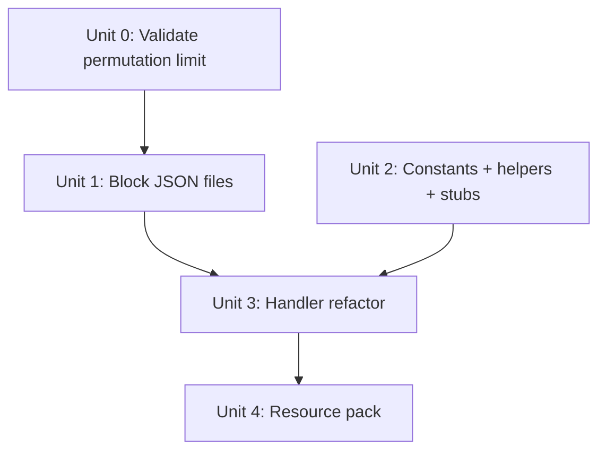

# refactor: Split exotic geometry classes into separate custom block types

## Overview

Split the single `bigdoors:door_panel` block into five block types — one per geometry class — to relieve the permutation budget (currently 61,440 / 65,536 = 94%) and unblock future geometry expansion.

## Problem Frame

The door_panel block encodes all geometry classes (full block, fence, bars, pane, slab) via a shared `geometry_id` state with 15 values. This state multiplies against every other axis (16 × 16 materials × 8 rotations × 2 overlay), consuming 61,440 of the 65,536 Bedrock permutation limit. Adding even one more geometry ID would cap out the budget. Splitting into per-class block types lets each carry only its own geometry variants, opening massive headroom.

## Requirements Trace

- R1. Each geometry class (full block, fence, bars, pane, slab) gets its own custom block type
- R2. All existing gameplay behavior is preserved — placement, opening, closing, neighbor matching, redstone, overlay
- R3. Existing worlds migrate seamlessly via lazy migration — old `door_panel` blocks remain valid until naturally cycled through open/close (no explicit migration sweep)
- R4. The permutation budget drops well below the 65,536 limit for each NEW block type (the legacy `door_panel` remains unchanged for lazy migration; trimming it is a future follow-up)
- R5. The shared 16×16 material encoding is preserved across all block types

## Scope Boundaries

- **In scope:** New block JSON files, script refactoring to resolve the correct block type, updated typeId checks, tests
- **Not in scope:** Compact per-class material encoding (future optimization), new geometry types, recipe changes (none exist currently)

## Context & Research

### Relevant Code and Patterns

- `bigdoors_bp/blocks/door_panel.json` — current 6,880-line monolith with 469 permutation conditions
- `bigdoors_bp/scripts/util/Constants.js` — `PANEL_BLOCK_ID`, `GEOMETRY_INDEX`, `GEOMETRY_CLASS_*`, `MATERIAL_GEOMETRY_CLASS`
- `bigdoors_bp/scripts/domain/MaterialRegistry.js` — `panelBlockStates()`, `geometryClassForMaterial()`, `resolveGeometryId()`, `resolveVerticalGeometryId()`
- `bigdoors_bp/scripts/handler/PanelPlacementHandler.js` — 8 references to `PANEL_BLOCK_ID` (typeId checks + `BlockPermutation.resolve` calls)
- `bigdoors_bp/scripts/handler/InteractionHandler.js` — 2 `BlockPermutation.resolve` calls during open/close
- `bigdoors_bp/scripts/handler/HingePlacementHandler.js` — 3 references (neighbor detection + overlay strip)
- `bigdoors_bp/scripts/subsystem/RedstoneSubsystem.js` — 3 references (skip-self + open/close resolve)
- `bigdoors_bp/scripts/handler/BreakHandler.js` — 1 import (dispatched via component, not typeId)
- `bigdoors_bp/scripts/main.js` — `bigdoors:panel_component` registration (generic, no typeId logic)
- `bigdoors_rp/texts/en_US.lang` — block display names

### Key Observations

- **Domain layer is clean.** `DoorManager`, `DoorAssembly`, `MaterialRegistry`, `PanelRotation` never reference block typeId strings. The refactor is contained to the handler/subsystem layer + block JSONs + Constants.
- **Custom component dispatch.** `main.js` registers `bigdoors:panel_component` with generic callbacks (no typeId-specific logic). Each new block JSON just needs to declare this same component.
- **8 `BlockPermutation.resolve(PANEL_BLOCK_ID, ...)` call sites** are the core mutation points: PanelPlacementHandler (3), InteractionHandler (2), RedstoneSubsystem (2), HingePlacementHandler (1). Each already computes geometry class or has access to geometry ID, so resolving the correct block type is straightforward.
- **9 `typeId === PANEL_BLOCK_ID` checks** for skip-self and neighbor detection need to become set-membership checks: PanelPlacementHandler (6), HingePlacementHandler (2), RedstoneSubsystem (1).
- **Persistence is geometry-agnostic.** Panel positions store `materialIndex` and `geometryId` as integers — no block typeId is persisted. Existing save data works without migration.
- **Manager does NOT re-place blocks on load.** `DoorManager.load()` only deserializes assembly data into memory — it does not touch world blocks. This means existing exotic-geometry `door_panel` blocks must remain valid after the update. The old `door_panel.json` must keep all 15 geometry_id values so existing blocks continue to render correctly.
- **Loot is script-handled.** `BreakHandler` spawns the original vanilla item; loot table is `empty.json`. No per-block loot changes needed.
- **Dead import in BreakHandler.** `PANEL_BLOCK_ID` is imported but never used for panel logic (dispatched via component). Clean up during refactor.

## Key Technical Decisions

- **Split axis: geometry class only.** Keep the shared 16×16 material encoding. Each sub-block carries the same `material_group`/`material_id`/`panel_rotation`/`overlay` states but only the `geometry_id` values relevant to its class. This is the simplest refactor with the biggest budget payoff.
- **Resolve block type from geometry class at call sites.** Add a `panelBlockIdForGeoClass(geoClass)` helper to Constants.js. Every `BlockPermutation.resolve` call site already knows the geometry class, so it passes the result of this helper instead of the hardcoded `PANEL_BLOCK_ID`.
- **Set-based typeId checking.** Replace `typeId === PANEL_BLOCK_ID` comparisons with `PANEL_BLOCK_IDS.has(typeId)` using a `Set` constant.
- **Reuse `bigdoors:panel_component`.** All new block types declare the same custom component. No changes to `main.js` component registration.
- **Lazy migration for existing worlds.** The manager does NOT re-place blocks on world load (it only restores in-memory assembly data). Therefore, keep the original `door_panel.json` intact with all 15 geometry_id values so existing blocks remain valid. New placements and open/close cycles will resolve to the split block types via the helper. Old blocks naturally migrate the first time their door is cycled.
- **`_clearBoundaryOverlays` uses `block.typeId` directly.** The overlay-strip methods in PanelPlacementHandler and HingePlacementHandler read block state and re-resolve the permutation. After the split, they should use the block's own `typeId` (read from the world) rather than computing it from a helper, since the block may be an old `door_panel` or a new split type.
- **Keep global geometry IDs.** Do not renumber geometry IDs per block type. The domain layer's `resolveGeometryId()` returns specific global IDs (1-4 for fence, 5/9-11 for bars, etc.), and the `GEOMETRY_INDEX` array maps by position. Renumbering would cascade changes through domain code and tests for zero permutation savings.
- **Helper placement: `panelBlockIdForGeoClass` in Constants.js, `panelBlockIdForMaterial` in MaterialRegistry.js.** This avoids a circular dependency — MaterialRegistry already imports from Constants, so Constants must not import from MaterialRegistry.

## Open Questions

### Resolved During Planning

- **World-wide permutation limit.** The original plan noted "65,536 world-wide" but this appears to refer to unique permutations simultaneously in a loaded area, not the sum of all defined permutations across block types. **Unit 0 validates this assumption before proceeding.** If wrong, the plan must be restructured to include compact material encoding as a prerequisite.
- **Non-contiguous geometry IDs.** Bedrock block states use explicit value arrays (e.g., `[5, 9, 10, 11]`), not min/max ranges. Non-contiguous IDs produce the expected multiplier (4 values = 4×, not 7× for a 5-11 range). Budget table numbers are correct. Verified from `door_panel.json` state format.
- **Overlay state on exotic blocks.** The `bigdoors:overlay` state only has visual effect for geometry_id=0 (full block). Decision: keep the state definition (values 0-1) on all block types so `panelBlockStates()` output is always valid for `BlockPermutation.resolve`. Omit only the overlay permutation *conditions* from exotic block JSONs (no geometry/texture switching needed). Cost: 2× permutations per block (Bedrock enumerates all state combinations regardless of conditions), but still well under budget.

### Deferred to Implementation

- **Whether door_panel.json can narrow geometry_id range.** With lazy migration, old `door_panel` blocks must keep all 15 geometry_id values to remain valid. This refactor keeps `door_panel.json` unchanged — no narrowing occurs in this scope. A future follow-up pass could add a one-time migration sweep to convert remaining legacy exotic blocks, then trim `door_panel.json`'s geometry_id range. This is deferred out of scope.

## Permutation Budget After Split

| Block type | geometry_id values | Permutation count | Headroom |
|---|---|---|---|
| `bigdoors:door_panel` (legacy, all geometries) | 15 (IDs 0-14, kept for lazy migration) | 61,440 (unchanged) | 4,096 free |
| `bigdoors:door_panel_fence` | 4 (solo/before/after/both) | 16×16×4×8×2 = 16,384 | 49,152 free |
| `bigdoors:door_panel_bars` | 4 (both/solo/before/after) | 16×16×4×8×2 = 16,384 | 49,152 free |
| `bigdoors:door_panel_pane` | 4 (both/solo/before/after) | 16×16×4×8×2 = 16,384 | 49,152 free |
| `bigdoors:door_panel_slab` | 2 (bottom/top) | 16×16×2×8×2 = 8,192 | 57,344 free |

## Implementation Units

- [ ] **Unit 0: Validate per-block permutation limit assumption**

**Goal:** Confirm that Bedrock's 65,536 permutation limit is per-block-type, not cumulative across all block types. This is a go/no-go gate for the entire refactor.

**Requirements:** R4

**Dependencies:** None

**Files:**
- Create: temporary test block JSONs (discarded after validation)

**Approach:**
- Create two minimal test block JSONs with enough combined state permutations to exceed 65,536 total (e.g., two blocks each with ~40,000 permutations via large integer state ranges)
- Load them in a Bedrock test world
- If both blocks work without content log errors, the limit is per-block — proceed with the refactor
- If Bedrock rejects them, the limit is cumulative — restructure the plan to include compact material encoding as a prerequisite

**Test expectation:** none — disposable experiment

**Verification:**
- Both test blocks load and can be placed without errors, OR the plan is restructured before proceeding

---

- [ ] **Unit 1: Create new block JSON files**

**Goal:** Create four new block JSON files for the exotic geometry classes. Keep `door_panel.json` intact for lazy migration.

**Requirements:** R1, R3, R4

**Dependencies:** None

**Files:**
- Create: `bigdoors_bp/blocks/door_panel_fence.json`
- Create: `bigdoors_bp/blocks/door_panel_bars.json`
- Create: `bigdoors_bp/blocks/door_panel_pane.json`
- Create: `bigdoors_bp/blocks/door_panel_slab.json`

**Approach:**
- Each new JSON follows the existing `door_panel.json` structure: `format_version`, `minecraft:block` with identifier, states, components, permutations
- States: same `material_group`, `material_id`, `panel_rotation`, `overlay` as current. `geometry_id` uses explicit value arrays (Bedrock's state format supports non-contiguous lists) with global IDs: fence `[1,2,3,4]`, bars `[5,9,10,11]`, pane `[7,12,13,14]`, slab `[6,8]`
- Components: same base components (`minecraft:loot`, `minecraft:map_color`, `bigdoors:panel_component`, `minecraft:destructible_by_mining`, etc.)
- Permutations: copy the relevant geometry, collision, selection, rotation/transformation, and material_instances permutations from door_panel.json. Remove the ones that don't apply to this class
- **Do NOT modify `door_panel.json`.** It must keep all 15 geometry_id values so existing blocks in old worlds remain valid (lazy migration). New placements will go to the split block types; old blocks are naturally replaced when their door is opened/closed.
- Keep the `bigdoors:overlay` state definition (values 0-1) on all exotic block JSONs so that `panelBlockStates()` output is always valid for `BlockPermutation.resolve`. Only omit the overlay permutation *conditions* (the geometry/texture switching rules), since overlay has no visual effect on exotic geometries. This saves JSON size but not permutation count — Bedrock enumerates all state combinations regardless of conditions.
- Each new block JSON MUST include `bigdoors:panel_component` in its components section. Without it, breaking the block will not trigger `handlePanelBreak` and the assembly state will become inconsistent.
- New block JSONs should NOT include a `menu_category` / creative category — they are script-placed only, never player-placed.

**Patterns to follow:**
- Existing `door_panel.json` structure
- Existing `hinge.json` for naming convention

**Test scenarios:**
- Happy path: Each new JSON file is valid Bedrock block JSON with correct format_version, identifier, and component structure
- Edge case: Permutation counts per block stay within 65,536 (verify by computing state-space product from the states section)
- Happy path: Old `door_panel.json` still loads without errors (unchanged)

**Verification:**
- Each new block loads without errors in Bedrock (no content log warnings about permutations or missing components)
- Old `door_panel` blocks in existing worlds continue to render and interact correctly

---

- [ ] **Unit 2: Update Constants.js and MaterialRegistry.js**

**Goal:** Add new block ID constants, a block-type resolver helper, and a set for typeId membership checks.

**Requirements:** R1, R2

**Dependencies:** None (can be done in parallel with Unit 1)

**Files:**
- Modify: `bigdoors_bp/scripts/util/Constants.js`
- Modify: `bigdoors_bp/scripts/domain/MaterialRegistry.js`
- Modify: `tests/stubs/minecraft-server.mjs`
- Test: `tests/MaterialRegistry.test.mjs`

**Approach:**
- In Constants.js: Add constants `PANEL_FENCE_BLOCK_ID`, `PANEL_BARS_BLOCK_ID`, `PANEL_PANE_BLOCK_ID`, `PANEL_SLAB_BLOCK_ID`
- In Constants.js: Add `PANEL_BLOCK_IDS` Set containing all five panel block IDs (including the original `PANEL_BLOCK_ID`)
- In Constants.js: Add `panelBlockIdForGeoClass(geoClass)` function that maps `GEOMETRY_CLASS_FENCE` → `PANEL_FENCE_BLOCK_ID`, etc., defaulting to `PANEL_BLOCK_ID` for full block
- In MaterialRegistry.js: Add `panelBlockIdForMaterial(matIdx)` convenience that calls `geometryClassForMaterial` → `panelBlockIdForGeoClass`. Must live in MaterialRegistry (not Constants) to avoid circular dependency — MaterialRegistry imports Constants, so Constants must not import MaterialRegistry.
- Keep `panelBlockStates()` pure (states only). Call sites resolve the block ID separately.
- Update `tests/stubs/minecraft-server.mjs`: verify `BlockPermutation.resolve` stub accepts arbitrary typeId strings (the new block type IDs). Update any existing test assertions that hardcode `PANEL_BLOCK_ID` in expected resolve calls.

**Patterns to follow:**
- Existing constant naming: `HINGE_BLOCK_ID`, `HIDDEN_HINGE_BLOCK_ID`, `PANEL_BLOCK_ID`
- Existing helper pattern: `geometryClassForMaterial()`

**Test scenarios:**
- Happy path: `panelBlockIdForGeoClass(GEOMETRY_CLASS_FENCE)` returns `PANEL_FENCE_BLOCK_ID`
- Happy path: `panelBlockIdForGeoClass(0)` (or undefined/null) returns `PANEL_BLOCK_ID` (full block default)
- Happy path: `panelBlockIdForMaterial(80)` (oak_fence) returns `PANEL_FENCE_BLOCK_ID`
- Happy path: `panelBlockIdForMaterial(0)` (oak_planks, full block) returns `PANEL_BLOCK_ID`
- Edge case: `PANEL_BLOCK_IDS` contains all five block IDs
- Happy path: `panelBlockIdForGeoClass(GEOMETRY_CLASS_BARS)` returns `PANEL_BARS_BLOCK_ID`
- Happy path: `panelBlockIdForGeoClass(GEOMETRY_CLASS_PANE)` returns `PANEL_PANE_BLOCK_ID`
- Happy path: `panelBlockIdForGeoClass(GEOMETRY_CLASS_SLAB)` returns `PANEL_SLAB_BLOCK_ID`

**Verification:**
- All existing tests pass unchanged
- New helper tests pass
- No domain code imports `@minecraft/server`

---

- [ ] **Unit 3: Refactor handler and subsystem call sites**

**Goal:** Update all 8 `BlockPermutation.resolve(PANEL_BLOCK_ID, ...)` call sites and 9 `typeId === PANEL_BLOCK_ID` checks to use the new block type resolver and set.

**Requirements:** R2, R3

**Dependencies:** Unit 2

**Files:**
- Modify: `bigdoors_bp/scripts/handler/PanelPlacementHandler.js`
- Modify: `bigdoors_bp/scripts/handler/InteractionHandler.js`
- Modify: `bigdoors_bp/scripts/handler/HingePlacementHandler.js`
- Modify: `bigdoors_bp/scripts/handler/BreakHandler.js`
- Modify: `bigdoors_bp/scripts/subsystem/RedstoneSubsystem.js`
- Test: `tests/InteractionHandler.test.mjs`
- Test: `tests/PanelPlacementHandler.test.mjs`
- Test: `tests/RedstoneSubsystem.test.mjs`
- Test: `tests/HingePlacementHandler.test.mjs`

**Approach:**
- **`BlockPermutation.resolve` calls (8 sites):** Each call site already knows the material index or geometry class. Replace `PANEL_BLOCK_ID` with the result of `panelBlockIdForMaterial(matIdx)`.
  - `InteractionHandler.js` lines 164, 238: has `matIdx` in scope → use `panelBlockIdForMaterial(matIdx)`
  - `RedstoneSubsystem.js` lines 259, 319: needs block ID added to the movement tuple
  - `PanelPlacementHandler.js` line 213: has `matIdx` → use `panelBlockIdForMaterial(matIdx)`
  - `PanelPlacementHandler.js` line 305 (`_updateNeighborGeometry`): use `panelBlockIdForMaterial(neighborMatIdx)`. This intentionally migrates legacy `door_panel` neighbors to the correct split block type — safe because the states are identical.
  - `PanelPlacementHandler.js` line 353 (`_clearBoundaryOverlays`): use `block.typeId` directly from the world block, since it may be an old `door_panel` or a new split type
  - `HingePlacementHandler.js` line 169 (`_clearBoundaryOverlays`): same — use `block.typeId` directly
- **typeId checks (9 sites):** Replace `=== PANEL_BLOCK_ID` with `PANEL_BLOCK_IDS.has(typeId)` (4 sites use `===`, 5 use `!==` which becomes `!PANEL_BLOCK_IDS.has()`):
  - `PanelPlacementHandler.js` lines 63, 89, 248 (`===`), 283, 343, 350 (`!==`) — 6 checks
  - `HingePlacementHandler.js` lines 149 (`===`), 166 (`!==`) — 2 checks. Note: line 166 is the guard for `_clearBoundaryOverlays`; it needs the set check AND the resolve on line 169 needs `block.typeId` — two changes at that site.
  - `RedstoneSubsystem.js` line 181 (1 check) — keep the existing `HINGE_BLOCK_ID` and `HIDDEN_HINGE_BLOCK_ID` checks alongside the new `PANEL_BLOCK_IDS.has()` set check
- **RedstoneSubsystem movement tuples:** The tuple `{ source, dest, states }` needs a `blockId` field so the resolve call can use the correct type. Compute `blockId` via `panelBlockIdForMaterial(matIdx)` in the tuple-building loop (where `matIdx` is already in scope), then use `t.blockId` in the phase-2 resolve call.
- **BreakHandler.js:** Clean up dead `PANEL_BLOCK_ID` import (it is imported but never used for panel logic).

**Patterns to follow:**
- Existing pattern: `this._isHingeBlock(block.typeId)` in PanelPlacementHandler uses a helper for set checking. The new `PANEL_BLOCK_IDS.has()` is analogous.

**Test scenarios:**
- Happy path: Placing a fence material resolves to `bigdoors:door_panel_fence` block type
- Happy path: Placing a full-block material resolves to `bigdoors:door_panel` block type
- Happy path: Opening a fence door calls `BlockPermutation.resolve` with `PANEL_FENCE_BLOCK_ID`
- Happy path: Closing a fence door calls `BlockPermutation.resolve` with `PANEL_FENCE_BLOCK_ID`
- Happy path: Redstone-triggered open/close of bars door uses `PANEL_BARS_BLOCK_ID`
- Integration: Neighbor geometry update on fence panels uses `PANEL_FENCE_BLOCK_ID` for the resolve call
- Integration: Skip-self check in placement handler recognizes all five panel block IDs
- Integration: Hinge placement neighbor detection finds panels of any block type
- Edge case: Mixed-material door (fence + full block panels in same assembly) uses correct block type per panel

**Verification:**
- All existing tests pass (behavior unchanged)
- New tests verify correct block type resolution per geometry class
- No `BlockPermutation.resolve(PANEL_BLOCK_ID, ...)` calls remain in the codebase (except possibly in the full-block-only path)

---

- [ ] **Unit 4: Resource pack updates**

**Goal:** Add lang strings and ensure texture/model references work for the new block types.

**Requirements:** R1

**Dependencies:** Unit 1

**Files:**
- Modify: `bigdoors_rp/texts/en_US.lang`

**Approach:**
- Add display name entries for each new block type: `tile.bigdoors:door_panel_fence.name=Door Panel`, etc. (all share the same player-visible name since the player doesn't distinguish them)
- Geometry files and textures are shared (referenced by identifier, not by block type), so no changes needed in `models/` or `textures/`

**Test expectation:** none — pure config, no behavioral change

**Verification:**
- Blocks show correct display name in inventory/tooltip
- No "unknown block" warnings in content log

## System-Wide Impact

- **Interaction graph:** `bigdoors:panel_component` callbacks in `main.js` are type-agnostic — they dispatch to handler methods that receive the block, not the typeId. No changes to the component registration.
- **Error propagation:** No new failure paths. The `panelBlockIdForGeoClass` helper has a safe default (returns full-block type for unknown classes).
- **State lifecycle risks:** Existing world saves store `materialIndex` and `geometryId` as integers, never block typeId. Lazy migration: old `door_panel` blocks remain valid in the world until their door is cycled, at which point the open/close code places them using the new split block types. No data loss risk.
- **Duplicated open/close logic:** `InteractionHandler._attemptOpen`/`._close` and `RedstoneSubsystem._executeOpen`/`._closeSingleAssembly` contain near-identical three-phase block movement code. Both need the same block-type resolution change. This is existing tech debt that the refactor makes more visible — candidate for extraction into a shared utility as a follow-up.
- **API surface parity:** Java edition is not affected (different block system). No external API consumers.
- **Integration coverage:** The open/close cycle (interact → clear sources → place destinations with correct block type) is the critical cross-layer path. Tests should verify the full cycle with exotic materials.
- **Mixed-material assemblies:** Each panel in an assembly is independently placed and may resolve to a different block type based on its own material (e.g., fence panels as `door_panel_fence`, full-block panels as `door_panel`). The domain layer sees only `materialIndex` and `geometryId`, not block typeId, so serialization and state management are unaffected.
- **Unchanged invariants:** The `panelBlockStates()` function remains unchanged — it still returns the same state object. Only the block type ID passed to `BlockPermutation.resolve` changes.

## Risks & Dependencies

| Risk | Mitigation |
|------|------------|
| World-wide permutation limit is actually the sum of all block definitions (not per-block) | Failure is obvious (Bedrock error on load). Fallback: compact material encoding per block type reduces totals dramatically. |
| Old `door_panel` blocks coexist with new split blocks indefinitely | `PANEL_BLOCK_IDS` set includes `door_panel`, so all typeId checks work for both old and new blocks. Old blocks are fully functional and migrate naturally when their door is cycled. |
| Block JSON file size and duplication | Each exotic block JSON is smaller than the current monolith since it only carries its own geometry/collision/material permutations. Total file size increases but each file is manageable. |
| Shared material encoding allows semantically invalid state combinations | Exotic blocks accept material indices for the wrong geometry class (e.g., `door_panel_fence` with oak_planks material). Harmless — blocks are always script-placed, never in creative inventory. Known limitation. |

## Sources & References

- Related code: `bigdoors_bp/blocks/door_panel.json`, `bigdoors_bp/scripts/util/Constants.js`
- Related plans: `docs/plans/2026-05-18-001-fix-pane-bars-collision-neighbor-matching-plan.md` (geometry ID system)
- Related plans: `docs/plans/2026-05-14-001-feat-multi-block-hinge-doors-plan.md` (original single-block architecture decision)
